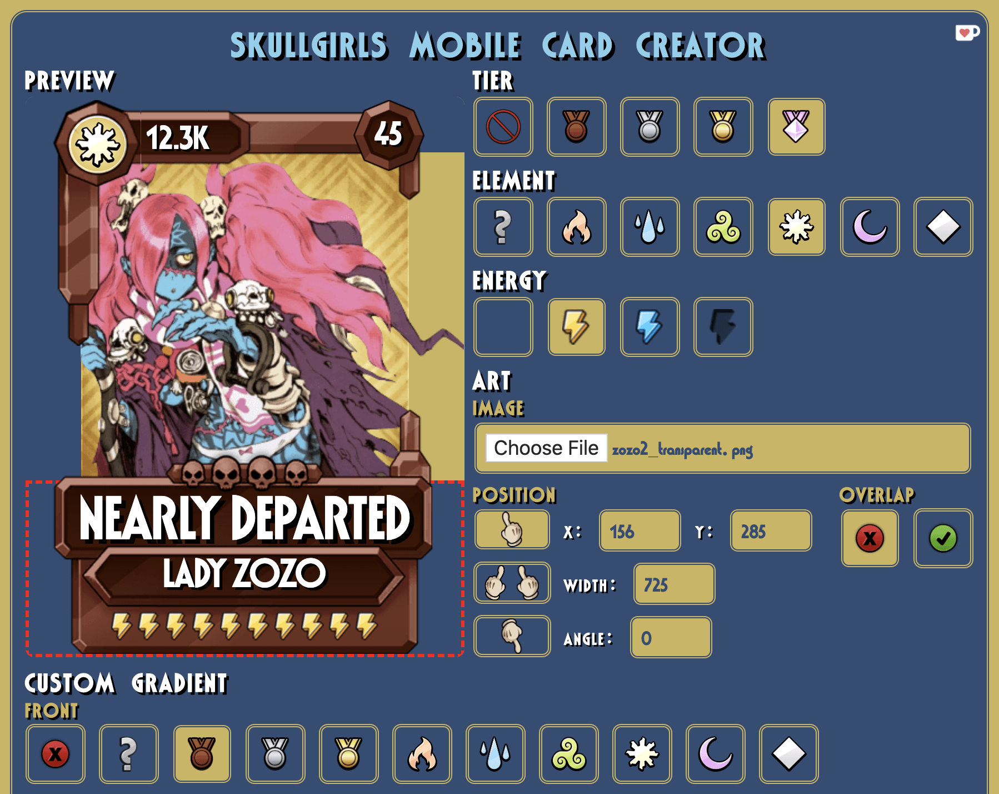

# Skullgirls Mobile Card Creator

A tool for creating custom Skullgirls Mobile fighter cards.
It performs best in Google Chrome and works in Safari both on desktop and on mobile devices.
It should also work for Firefox, but I have not tested the website in any other browser.

The official design of cards has changed slightly in version 3.1.0 of Skullgirls Mobile.
I presume this is part of the optimizations as noted in the [patch notes](https://forum.skullgirlsmobile.com/threads/official-3-1-update-notes-coming-soon.5246/).

This website was made during version 3.0.0 and thus generates cards consistent with the designs of 3.0.0.
I do not plan on updating the look of the cards, partially because I prefer the old look.

## Features

### Preview

In the card preview area, you can modify the card text (fighter score, level, variant name, and character name).
The text will automatically reduce in font size to fit within its designated area.

You can also move, scale, and rotate your uploaded image by interacting with the card background.

Clicking on the top, left, right, or bottom area of the card will activate a mask that crops out the parts of your uploaded image which lie beyond the top, left, right, or bottom edge of the card.

### Basic Options

You can choose the tier, element, and energy type of the card and you can upload an image to use as card art.

With your uploaded image, you have the option to edit it using the text inputs or by selecting the move, scale, or rotate tool and then interacting with the card preview area.
You can also specify whether the image should overlap the top border of the card.

If the dimensions of your image is 360x340px, it is assumed to be from the [SGM Palette Editor](https://github.com/Krazete/sgmpalette).
The optimal position parameters will be automatically set.

If your image's file name follows the Palette Editor naming scheme, the card character name will also be automatically set.

### Custom Gradients

The custom gradients allow you to override the default colors specified by the tier and element options.

You can select one of the familiar presets or you can make your own gradient by using the text input or the interactive preview bar.

For text input, your gradient must be formatted as a list of paired values `COLOR BRIGHT%`, where `COLOR` is the color name or hex code and `BRIGHT` is the brightness value onto which the color will be mapped.

### GIF Support

This website supports the creation of animated cards (somewhat) thanks to the following libraries:

* [buzzfeed/libgif-js](https://github.com/buzzfeed/libgif-js) for converting gif frames to canvas context
* [jnordberg/gif.js](https://github.com/jnordberg/gif.js) for encoding canvas animations to gif data
* [Stuk/jszip](https://github.com/Stuk/jszip) for creating a zip file of multiple frames
* [eligrey/FileSaver.js](https://github.com/eligrey/FileSaver.js) for downloading heavy files

All animated cards are rendered with a frame delay of one millisecond.
They also have a lower image quality and an opaque black background.
The frame rate, quality, and transparency are not adjustable because GIFs are a pain and the HTML Canvas doesn't play well with GIFs.

<!--
## Background Processes

### Gradient Maps

Gradient maps are applied after running them through a series of canvas-based operations.

1. Load an image, draw it in a canvas, and average the color values of each pixel to get brightness values (this formula isn't quite right, but it's good enough).
2. Load the gradient map and draw it stretched out on a 256px by 1px canvas.
3. Map the image brightness values `i` to the `i`th gradient value to get the mapped color.
4. Draw the new data to a canvas and take the `dataURL` from that canvas to use as an image `src`.

Foreground gradients are loaded from images in the [gradient](gradient) folder.

Background gradients are not loaded from images because I could not find these gradient maps in the APK.
Instead, I loaded cropped in-game screenshots as card art and repeatedly adjusted colors and percentages of the background gradient until I achieved an acceptable approximation.

### Image Transformations

The interactive image editing tools use basic distance and angle formulas to adjust the CSS properties of the uploaded image.

These operations depend on the position of initial mouse click.
To make it work on mobile devices, only the first touch input is used and is treated as a mouse input. Page scrolling and zooming is disabled when the card preview area is in use.

### Rendering

The process of rendering the card preview area into a downloadable image relies heavily on the `window.getComputedStyle` function to obtain the position, transformation, and clip path of all necessary elements.

This was difficult to understand and complete because many of these CSS properties have varying origin points; some are relative to the element, some are relative to the preview area, and some are relative to the window.
The order for applying clip paths and transformation matrices also compounded my confusion until I took an hour of hard thinking to figure it out.

I decided to add support for animated GIFs due to some memes that Budget posted in the Skullgirls Discord server. It took an entire day and mostly involved a struggle with asynchronicity and promises.
-->
